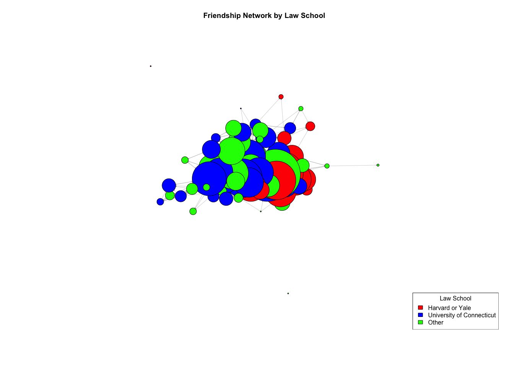
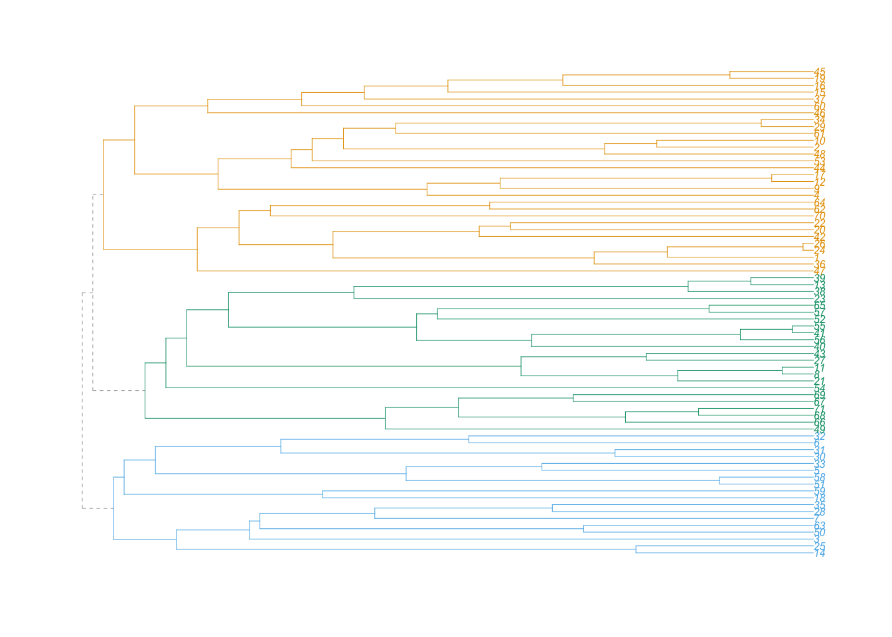

201976373_ME202_Final
================
2024-08-15

    ## Loading required package: igraph

    ## 
    ## Attaching package: 'igraph'

    ## The following objects are masked from 'package:stats':
    ## 
    ##     decompose, spectrum

    ## The following object is masked from 'package:base':
    ## 
    ##     union

    ## Loading required package: knitr

    ## Loading required package: dplyr

    ## 
    ## Attaching package: 'dplyr'

    ## The following objects are masked from 'package:igraph':
    ## 
    ##     as_data_frame, groups, union

    ## The following objects are masked from 'package:stats':
    ## 
    ##     filter, lag

    ## The following objects are masked from 'package:base':
    ## 
    ##     intersect, setdiff, setequal, union

    ## Loading required package: dendextend

    ## 
    ## ---------------------
    ## Welcome to dendextend version 1.17.1
    ## Type citation('dendextend') for how to cite the package.
    ## 
    ## Type browseVignettes(package = 'dendextend') for the package vignette.
    ## The github page is: https://github.com/talgalili/dendextend/
    ## 
    ## Suggestions and bug-reports can be submitted at: https://github.com/talgalili/dendextend/issues
    ## You may ask questions at stackoverflow, use the r and dendextend tags: 
    ##   https://stackoverflow.com/questions/tagged/dendextend
    ## 
    ##  To suppress this message use:  suppressPackageStartupMessages(library(dendextend))
    ## ---------------------

    ## 
    ## Attaching package: 'dendextend'

    ## The following object is masked from 'package:stats':
    ## 
    ##     cutree

*1. Familiarise yourself with the three networks*

*Present in a table the density, reciprocity, and transitivity of the
advice friendship, and co-working networks.*

    ##      network   density reciprocity transitivity
    ## 1     Advice 0.1794769   0.3923767    0.4787826
    ## 2 Friendship 0.1156942   0.6121739    0.4486229
    ## 3 Co-Working 0.2221328   0.6847826    0.4517800

*Plot each of these three networks with nodes sized and colored by a
property that you find most relevant and informative (there is no
“right” answer here, but some plots would be more interesting and
informative). Make sure to include a legend with each plot to help
interpret the node colours.*

<!-- --><!-- --><!-- -->

*Plot the indegree distributions in the three networks. You should
select the type of plot that represents the distributions most clearly.*

    ## [1] 71

    ##    Min. 1st Qu.  Median    Mean 3rd Qu.    Max. 
    ##    0.00    5.50   11.00   12.56   19.50   37.00

    ## [1] 38

    ##    Min. 1st Qu.  Median    Mean 3rd Qu.    Max. 
    ##    0.00    5.50   11.00   12.56   19.50   37.00

<!-- --><!-- -->

    ## [1] 71

    ##    Min. 1st Qu.  Median    Mean 3rd Qu.    Max. 
    ##   0.000   4.000   7.000   8.099  11.500  22.000

    ## [1] 23

    ##    Min. 1st Qu.  Median    Mean 3rd Qu.    Max. 
    ##   0.000   4.000   7.000   8.099  11.500  22.000

<!-- --><!-- -->

    ## [1] 71

    ##    Min. 1st Qu.  Median    Mean 3rd Qu.    Max. 
    ##    4.00   11.50   15.00   15.55   18.50   31.00

    ## [1] 32

    ##    Min. 1st Qu.  Median    Mean 3rd Qu.    Max. 
    ##    4.00   11.50   15.00   15.55   18.50   31.00

<!-- --><!-- -->

*Describe the patterns you observe (from the summary statistics and the
plots). What are the structures you observe, and how do the three types
of networks differ? What might these patterns tell us about the nature
of different kind of social relations in this firm?*

For the Coworking Network, the complementary CDF plot shows a gradual
decline, indicating a relatively smooth distribution of indegree values.
The minimum indegree value is 4, showing that there is an obligatory
collaborative element for all lawyers. The highest indegree is around
30, and the probability drops steadily as indegree increases. This
suggests that the coworking network is relatively well-distributed, with
no extreme centralization. Many lawyers have moderate levels of
indegree, indicating they receive interactions from multiple colleagues.
The probability distribution plot has a more varied pattern with peaks
at different indegree values, suggesting some variability in the
indegree distribution. This variability indicates that while some
lawyers receive more interactions, there isn’t a single dominant lawyer.
The network structure is relatively decentralized with moderate indegree
values. This indicates a well-distributed interaction network where many
lawyers interact with multiple colleagues. This can promote
collaborative working environments.

For the Friendship Network, the complementary CDF plot for the
friendship network shows a steeper decline compared to the coworking
network. The minimum indegee value is 0, meaning that some lawyers have
0 friendships within the entire network. The highest indegree observed
is around 20. This indicates that fewer lawyers have high indegree
values, and most have lower indegree. The friendship network is more
centralized compared to the coworking network. The probability
distribution plot shows several peaks, but with fewer lawyers having
very high indegree values. This pattern suggests that while there are
popular individuals, the overall distribution of friendships is less
evenly spread. A few lawyers are central, receiving many friendship
ties, while most have fewer friends. The network is more centralized
with fewer individuals having high indegree. This indicates that
friendships are more selective and concentrated around a few central
individuals. These central individuals may play key roles in the social
fabric of the firm.

For the Advice Network, the complementary CDF plot for the advice
network shows a similar pattern to the friendship network, but with a
higher maximum indegree value, being 37. This indicates that the Advice
Network has the highest level of centralization compared to the
Friendship and Coworking networks, with a few individuals being key
advice givers. The minimum indegree distribution is 0, showing that some
lawyers have 0 advisory connections within the entire network. The
difference between the mean and maximum indegree value is also the
highest compared to the other two networks, further enforcing the high
level of centralisation within the network. The probability distribution
plot shows multiple peaks, similar to the friendship network. This
suggests a mixed distribution where some individuals are central advice
givers, while others receive advice from fewer colleagues. The network
structure suggests a reliance on a few knowledgeable or experienced
lawyers. These central advice givers are likely critical to the
decision-making and mentoring processes in the firm.

Overall, these patterns reveal the nature of different social relations
within the firm, with coworking interactions being widespread (as the
mean and minimum indegree for coworking network is highest), while
friendship and advisory relationships are more centralized around key
individuals. This can have implications for network resilience,
information flow, and the firm’s social structure.

*2. How do the advice and friendship networks differ from random
networks with similar size and degree distribution?*

*Using the configuration model, create 10 random graphs that have the
same size and degree distribution as the advice network and 10 that have
the same size and degree distribution as the friendship network.*

Advice Network
<!-- --><!-- -->

Friendship Network
<!-- --><!-- -->

*Create a table to compare the reciprocity, average path length, and
transitivity in the empirical networks to those in the equivalent
randomized ones.*

Advice Network

    ##                      Network Reciprocity AveragePathLength Transitivity
    ## 1  Empirical: Advice Network   0.3923767          2.243267    0.4787826
    ## 2   Random: Advice Network 1   0.1381653          2.152970    0.3647319
    ## 3   Random: Advice Network 2   0.1505131          2.142828    0.3413628
    ## 4   Random: Advice Network 3   0.1461187          2.111778    0.3521183
    ## 5   Random: Advice Network 4   0.1211429          2.143863    0.3373502
    ## 6   Random: Advice Network 5   0.1596351          2.118195    0.3316124
    ## 7   Random: Advice Network 6   0.1571754          2.127303    0.3355946
    ## 8   Random: Advice Network 7   0.1622857          2.103705    0.3342795
    ## 9   Random: Advice Network 8   0.1515837          2.137032    0.3584721
    ## 10  Random: Advice Network 9   0.1379310          2.132685    0.3473003
    ## 11 Random: Advice Network 10   0.1386364          2.113641    0.3463053

Friendship Network

    ##                          Network Reciprocity AveragePathLength Transitivity
    ## 1  Empirical: Friendship Network   0.6121739          2.505126    0.4486229
    ## 2   Random: Friendship Network 1   0.1157324          2.321994    0.2871557
    ## 3   Random: Friendship Network 2   0.2049470          2.277260    0.2771441
    ## 4   Random: Friendship Network 3   0.1357143          2.306384    0.2929548
    ## 5   Random: Friendship Network 4   0.1592920          2.298928    0.2867069
    ## 6   Random: Friendship Network 5   0.1283422          2.299860    0.2845271
    ## 7   Random: Friendship Network 6   0.1443662          2.313607    0.2924791
    ## 8   Random: Friendship Network 7   0.1805310          2.310811    0.3105802
    ## 9   Random: Friendship Network 8   0.1663717          2.270232    0.2844191
    ## 10  Random: Friendship Network 9   0.1340388          2.268406    0.3094525
    ## 11 Random: Friendship Network 10   0.1625442          2.277260    0.3064187

*How do the two empirical networks compare to their associated
randomized graph? In your answer, make sure to give an intuitive
interpretation for each metric.*

Reciprocity is the proportion of mutual connections in the network. For
directed networks, it measures the likelihood that if node A connects to
node B, node B also connects to node A. The empirical reciprocity
(0.612174) is significantly higher than the mean of the randomized
networks (0.201283). This suggests that friendships among lawyers are
highly reciprocal, meaning mutual friendships are common. The empirical
reciprocity (0.392377) is also higher than the mean of the randomized
networks (0.167027). This indicates that advice-seeking relationships
are often reciprocated, though to a lesser extent than friendships. Both
the friendship and advice networks exhibit much higher reciprocity
compared to their randomized counterparts, indicating that mutual
relationships are a significant feature of these networks.

The average path length is the average number of steps along the
shortest paths for all possible pairs of network nodes. It measures the
efficiency of information flow within the network. The empirical average
path length (2.505126) is slightly higher than the mean of the
randomized networks (2.316243). This indicates that while friendships
are somewhat less efficient in terms of shortest paths compared to a
randomized network, the difference is not substantial. The empirical
average path length (2.243267) is higher than the mean of the randomized
networks (2.134891). Similar to the friendship network, the advice
network is slightly less efficient in terms of shortest paths. Both
networks have slightly higher average path lengths than the randomized
networks, suggesting that while they are somewhat less efficient, the
difference is not drastic. This may be due to the presence of cohesive
subgroups which increase the number of steps between some pairs of
nodes.

Transitivity (or clustering coefficient) measures the likelihood that
two neighbors of a node are also neighbors of each other. It indicates
the presence of tightly knit groups within the network. The empirical
transitivity (0.448623) is significantly higher than the mean of the
randomized networks (0.300018). This suggests that friendships among
lawyers form more cohesive groups than would be expected by chance. The
empirical transitivity (0.478783) is also much higher than the mean of
the randomized networks (0.358673). This indicates a high level of
clustering in advice-seeking relationships, forming tightly knit
advisory groups. The high transitivity in both networks compared to the
randomized networks highlights the presence of strong clustering. This
suggests that lawyers form tight-knit groups for both friendship and
advice, which is likely driven by common professional interests, shared
work environments, or social factors.

*What do these comparisons tell you about the nature and structure of
these relationships among the lawyers?*

It shows high reciprocity, as in the friendship network, empirical
reciprocity (0.612174) is significantly higher than the randomized mean
(0.201283) and in the advice network, empirical reciprocity (0.392377)
is higher than the randomized mean (0.167027). The high reciprocity
indicates that friendships among lawyers are largely mutual. This
suggests that social bonds are strong and that there is a culture of
mutual support and companionship. The relatively high reciprocity in the
advice network indicates that advice-seeking and giving is often a
two-way street. Lawyers who seek advice are also likely to give advice,
fostering a culture of mutual assistance and professional collaboration.

It also shows slightly higher average path length, as in the friendship
network, empirical average path length (2.505126) is slightly higher
than the randomized mean (2.316243) and in the advice network, empirical
average path length (2.243267) is slightly higher than the randomized
mean (2.134891). The slightly higher average path lengths suggest that
while the networks are slightly less efficient in terms of information
flow compared to random networks, they still maintain reasonable
connectivity. The slight increase may be due to the formation of
cohesive subgroups, which can increase the number of steps needed to
connect some pairs of nodes.

Finally, it shows high transitivity/clustering, as in the friendship
network, empirical transitivity (0.448623) is much higher than the
randomized mean (0.300018). In the advice network, empirical
transitivity (0.478783) is much higher than the randomized mean
(0.358673). The high transitivity in the friendship network indicates
that friendships are not just individual ties but often part of larger,
tightly knit groups. This suggests the presence of social circles or
cliques within the firm. The high transitivity in the advice network
suggests that advice relationships also form cohesive subgroups. Lawyers
who seek advice from one person are likely to seek or give advice within
the same subgroup, promoting knowledge sharing and mentorship within
these clusters.

The high reciprocity and transitivity indicate that the firm’s network
is characterized by strong social and professional cohesion. Lawyers are
not isolated; instead, they form part of mutually supportive and tightly
knit groups. The slightly higher average path length and high
transitivity suggest the presence of subgroups or cliques within the
network. These subgroups likely consist of lawyers who interact more
frequently with each other than with the rest of the network. Despite
the presence of subgroups, the network maintains a relatively efficient
structure. The average path length is only slightly higher than in
randomized networks, indicating that the overall network is still
well-connected. The high reciprocity in both networks points to a
culture of mutual support and collaboration. Lawyers are likely to
reciprocate both social interactions and professional advice, fostering
a collaborative environment.

*3. What seems to dictate the structure of the networks?*

*Calculate the assortativity for gender, age, and status in the advice,
friendship, and cowork networks. Present the results in a table.*

Status is a categorical variable Age is a continuous variable Gender is
a categorical variable

    ##      Network Attribute Assortativity
    ## 1     Advice    Gender    0.08675764
    ## 2     Advice       Age    0.23669827
    ## 3     Advice    Status    0.31988773
    ## 4 Friendship    Gender    0.20626341
    ## 5 Friendship       Age    0.44640519
    ## 6 Friendship    Status    0.55214747
    ## 7     Cowork    Gender   -0.02138730
    ## 8     Cowork       Age   -0.04457620
    ## 9     Cowork    Status   -0.09978820

*Run the Walktrap community detection algorithm on the aggregate network
and see how the resulting communities align (or not) with the vertex
attributes. Include a plot of the aggregate network showing the results
of the community detection algorithm.*

    ##  [1] 1 1 2 1 2 2 2 3 1 1 3 1 3 2 1 1 1 2 1 1 3 1 3 1 2 1 3 2 1 2 2 2 2 1 2 1 1 3 3 3 3 1 3 1 1 1 1 1 3 2 2 3 1 3 3 3 3 2
    ## [59] 2 1 1 1 2 1 3 3 3 3 3 1 3

    ## memberships
    ##  1  2  3 
    ## 30 18 23

<!-- --><!-- -->

    ##    Node Community
    ## 1     1         1
    ## 2     2         1
    ## 4     4         1
    ## 9     9         1
    ## 10   10         1
    ## 12   12         1
    ## 15   15         1
    ## 16   16         1
    ## 17   17         1
    ## 19   19         1
    ## 20   20         1
    ## 22   22         1
    ## 24   24         1
    ## 26   26         1
    ## 29   29         1
    ## 34   34         1
    ## 36   36         1
    ## 37   37         1
    ## 42   42         1
    ## 44   44         1
    ## 45   45         1
    ## 46   46         1
    ## 47   47         1
    ## 48   48         1
    ## 53   53         1
    ## 60   60         1
    ## 61   61         1
    ## 62   62         1
    ## 64   64         1
    ## 70   70         1
    ## 3     3         2
    ## 5     5         2
    ## 6     6         2
    ## 7     7         2
    ## 14   14         2
    ## 18   18         2
    ## 25   25         2
    ## 28   28         2
    ## 30   30         2
    ## 31   31         2
    ## 32   32         2
    ## 33   33         2
    ## 35   35         2
    ## 50   50         2
    ## 51   51         2
    ## 58   58         2
    ## 59   59         2
    ## 63   63         2
    ## 8     8         3
    ## 11   11         3
    ## 13   13         3
    ## 21   21         3
    ## 23   23         3
    ## 27   27         3
    ## 38   38         3
    ## 39   39         3
    ## 40   40         3
    ## 41   41         3
    ## 43   43         3
    ## 49   49         3
    ## 52   52         3
    ## 54   54         3
    ## 55   55         3
    ## 56   56         3
    ## 57   57         3
    ## 65   65         3
    ## 66   66         3
    ## 67   67         3
    ## 68   68         3
    ## 69   69         3
    ## 71   71         3

    ## < table of extent 0 >

<!-- --><!-- -->

Evaluate alignment with vertex attributes

    ## # A tibble: 216 × 4
    ##    Community Attribute AttributeValue TotalCount
    ##    <fct>     <chr>     <fct>               <int>
    ##  1 1         Age       26                      0
    ##  2 1         Age       28                      0
    ##  3 1         Age       29                      0
    ##  4 1         Age       30                      0
    ##  5 1         Age       31                      3
    ##  6 1         Age       32                      1
    ##  7 1         Age       33                      0
    ##  8 1         Age       34                      1
    ##  9 1         Age       35                      1
    ## 10 1         Age       36                      1
    ## # ℹ 206 more rows

    ## # A tibble: 21 × 3
    ##    Community Attribute TotalCount
    ##    <fct>     <chr>          <int>
    ##  1 1         Age               30
    ##  2 1         Gender            30
    ##  3 1         LawSchool         30
    ##  4 1         Office            30
    ##  5 1         Practice          30
    ##  6 1         Seniority         30
    ##  7 1         Status            30
    ##  8 2         Age               18
    ##  9 2         Gender            18
    ## 10 2         LawSchool         18
    ## # ℹ 11 more rows

<!-- -->

Community 1 has the highest total count of 30 nodes, there are 18 nodes
within Community 2, and there are 23 nodes inside Community 3. For
Community 1, attribute values show varying counts, with some attribute
values having 0 occurances and others having up to 25 occurences.
Specific attributes like Age and Status have multiple attribute values
with 0 occurences, indicating no representation in Community 1 for those
values. Similar to Community 1, Community 2 also shows a range of
occurrences for different attribute values. This distribbution of
attribute values is more spread out compared to Community 1, suggesting
a more diverse representation of attributes. Community 3 appears to have
a more balanced representation across different attributes, with less
attribute values having 0 occurrences. This community seems to have a
higher average count per attribute value, indicating a more uniform
distribution.

*Discuss what the results of these two analyses imply about the nature
of relationships among the lawyers.*

The results of the assortativity analysis shows that in the advice
network, lawyers are slightly more likely to seek advice from those of
the same gender, more likely to seek advice from those of similar age,
and more likely to seek advice from those of similar status. In the
friendship network, friendships are more likely to form between lawyers
of the same gender, friendships are strongly likely to form between
lawyers of similar age, and there is a slight tendency for friendships
to form between lawyers of different status levels.

The walktrap community detection analysis reveals that the network is
divided into distinct communities, each densely connected internally.
These communities suggest that certain subgroups within the network have
stronger internal interactions. By examining the community assignments
and their attributes, we can see how certain attributes (e.g., gender,
age, status) align with these communities. The visual representation of
the communities shows distinct clusters, which may correlate with the
assortativity analysis results.

The positive assortativity values for gender, age, and status in the
advice and friendship networks indicate a preference for forming ties
with similar individuals. Homophily in gender and age is more pronounced
in the friendship network, while homophily in status is more significant
in the advice network.

The advice network shows moderate assortativity based on status,
suggesting that lawyers of similar ranks are more likely to seek advice
from each other, reinforcing hierarchical structures. The friendship
network has high age assortativity, indicating that social relationships
are strongly influenced by age similarity, potentially due to shared
life stages and experiences.

The Walktrap community detection highlights the presence of tight-knit
groups within the network. These communities likely represent subgroups
with frequent interactions, such as departmental teams or close
professional collaborators.

The assortativity and community detection results suggest that while
there are strong internal ties within communities, interactions across
communities may be less frequent. Efforts to foster cross-community
interactions could enhance collaboration and knowledge sharing across
the firm.

*4. What helps predict the existence of a relationship between lawyers?*

*Consider the exponential random graph models for the advice and
friendship networks shown below. The table shows estimates (and standard
errors in parentheses) of the coefficients for each term in exponential
random graph models that predict the log-odds of a tie in the (1) advice
and (2) friendship networks. The GWESP term has an alpha value of 0.7.
The odegree0 term is a term accounting for the nodes with an out-degree
of 0 in the friendship network (which can be ignored in your response).
The reference category for status is 2 (associate, a more junior
position).*

The ERGM results show that the existence of a relationship between
lawyers can be predicted by several key factors:

First, status, as higher-status lawyers are more likely to be sought for
advice, and to a lesser extent, sought for a friendship. Status is also
negatively correlated with the seeking of advice, meaning the higher the
status, the lower the likeliness of seeking advice.

Second, gender and proximity, as lawyers are more likely to form ties
with others of the same gender and those in the same office. This shows
the importance of both gender homophily and physical proximity.

Third, reciprocity and triadic closure, both advice and friendship
networks show a strong tendency towards reciprocity and triadic closure,
particularly in the friendship network, suggesting that these social
processes are crucial in forming and maintaining relationships among
lawyers. Although in the friendship network, there is a higher rate of
reciprocity, likely due to the fact that in the advice network,
relationships are often formed between two lawyers of differing status,
and the one of higher status is unlikely to seek advice from the lawyer
of the lower status.

The fact that the alpha value for the GWESP term is 0.7 means that the
influence of shared partners on the likelihood of forming a tie decays
at a moderate rate, and is considered a low alpha, pointing towards high
clustering. Each additional shared partner contributes to the likelihood
of a tie because the alpha is low, but because it is not *very* low, the
influence of each subsequent shared partner still diminishes as more
shared partners are considered, and the impact of each new shared
partner on the likelihood of tie formation is somewhat less significant
than the previous one. This reflects a realistic scenario in social
networks, where a few shared connections might significantly increase
the likelihood of forming a new tie, but beyond a certain point,
additional shared partners have less incremental impact.

*Interpret each term in the ERGMs (except gwesp.decay and odegree0). How
does each term influence whether or not two lawyers are connected? Use
odds ratios in your substantive interpretation of each term.*

| Term                                    | Interpretation                                                                                                                                   |
|:----------------------------------------|:-------------------------------------------------------------------------------------------------------------------------------------------------|
| baseline probability (edges)            | In the advice network, a 1-unit increase in baseline probability (edges) decreases the odds of forming a tie by 98.62 % (OR: 0.01 ).             |
| age (nodecov.Age)                       | In the advice network, a 1-unit increase in age (nodecov.Age) decreases the odds of forming a tie by 1 % (OR: 0.99 ).                            |
| status (receiver, nodeifactor.Status.1) | In the advice network, a 1-unit increase in status (receiver, nodeifactor.Status.1) increases the odds of forming a tie by 177.32 % (OR: 2.77 ). |
| status (sender, nodeofactor.Status.1)   | In the advice network, a 1-unit increase in status (sender, nodeofactor.Status.1) decreases the odds of forming a tie by 25.17 % (OR: 0.75 ).    |
| same gender (nodematch.Gender)          | In the advice network, a 1-unit increase in same gender (nodematch.Gender) increases the odds of forming a tie by 28.4 % (OR: 1.28 ).            |
| same office (nodematch.Office)          | In the advice network, a 1-unit increase in same office (nodematch.Office) increases the odds of forming a tie by 129.33 % (OR: 2.29 ).          |
| same practice (nodematch.Practice)      | In the advice network, a 1-unit increase in same practice (nodematch.Practice) increases the odds of forming a tie by 143.51 % (OR: 2.44 ).      |
| mutual                                  | In the advice network, a 1-unit increase in mutual increases the odds of forming a tie by 64.87 % (OR: 1.65 ).                                   |
| gwesp                                   | In the advice network, a 1-unit increase in gwesp increases the odds of forming a tie by 53.73 % (OR: 1.54 ).                                    |

Interpretations for Advice Network

| Term                                    | Interpretation                                                                                                                                      |
|:----------------------------------------|:----------------------------------------------------------------------------------------------------------------------------------------------------|
| baseline probability (edges)            | In the friendship network, a 1-unit increase in baseline probability (edges) decreases the odds of forming a tie by 98.99 % (OR: 0.01 ).            |
| age (nodecov.Age)                       | In the friendship network, a 1-unit increase in age (nodecov.Age) decreases the odds of forming a tie by 1 % (OR: 0.99 ).                           |
| status (receiver, nodeifactor.Status.1) | In the friendship network, a 1-unit increase in status (receiver, nodeifactor.Status.1) increases the odds of forming a tie by 32.31 % (OR: 1.32 ). |
| status (sender, nodeofactor.Status.1)   | In the friendship network, a 1-unit increase in status (sender, nodeofactor.Status.1) increases the odds of forming a tie by 8.33 % (OR: 1.08 ).    |
| same gender (nodematch.Gender)          | In the friendship network, a 1-unit increase in same gender (nodematch.Gender) increases the odds of forming a tie by 18.53 % (OR: 1.19 ).          |
| same office (nodematch.Office)          | In the friendship network, a 1-unit increase in same office (nodematch.Office) increases the odds of forming a tie by 68.2 % (OR: 1.68 ).           |
| same practice (nodematch.Practice)      | In the friendship network, a 1-unit increase in same practice (nodematch.Practice) increases the odds of forming a tie by 29.69 % (OR: 1.3 ).       |
| mutual                                  | In the friendship network, a 1-unit increase in mutual increases the odds of forming a tie by 991.35 % (OR: 10.91 ).                                |
| gwesp                                   | In the friendship network, a 1-unit increase in gwesp increases the odds of forming a tie by 124.79 % (OR: 2.25 ).                                  |

Interpretations for Friendship Network

edges: This is the baseline probability of a tie forming. The negative
coefficients indicate that ties are generally unlikely to form in both
networks, with friendship ties being slightly less likely than advice
ties.

nodecov.Age: For each year increase in age, the odds of forming a tie
decrease by about 1% in both networks. Age has a slight negative effect
on tie formation.

nodeifactor.Status.1: Lawyers with status 1 (possibly partners) are more
likely to receive ties. In the advice network, they are about 2.8 times
more likely to receive advice ties, while in the friendship network,
they are about 1.3 times more likely to receive friendship ties.

nodeofactor.Status.1: Lawyers with status 1 are about 25% less likely to
send advice ties, but slightly more likely (8.3% increase) to send
friendship ties.

nodematch.Gender: Lawyers of the same gender are about 28.4% more likely
to form advice ties and 18.5% more likely to form friendship ties.

nodematch.Office: Lawyers in the same office are about 2.3 times more
likely to form advice ties and 1.7 times more likely to form friendship
ties.

nodematch.Practice: Lawyers in the same practice area are about 2.4
times more likely to form advice ties and 1.3 times more likely to form
friendship ties.

mutual: Mutual ties are about 1.6 times more likely in the advice
network, but dramatically more likely (about 11 times) in the friendship
network.

gwesp: This term indicates the tendency for triadic closure. Both
networks show a positive effect, with friendship ties showing a stronger
tendency for triadic closure than advice ties.

*How do the terms in the two ERGMs compare?*

Both networks display homophily effects, with these effects generally
being stronger in the advice network, specifically for office and
practice, reflecting the professional nature of these ties.

The friendship network displays a much more robust tendency for
reciprocity and triadic closure compared to the advice network. This
suggests that mutual ties are crucial for friendship formation and that
social ties are more likely to form within existing groups of friends.

Age has a minor negative effect on tie formation in both networks.

Lawyer status affects tie formation differently in two networks, with
high-status lawyers more likely to receive ties in both networks but
less likely to initiate advice ties. Furthmore, status plays a much more
significant role in the advice network, indicating the importance of
hierarchy in professional interactions.

Overall, both networks have a low baseline probability of forming ties,
and both networks show similar patterns regarding age (slight negative
effect) and gender homophily (positive effect).
